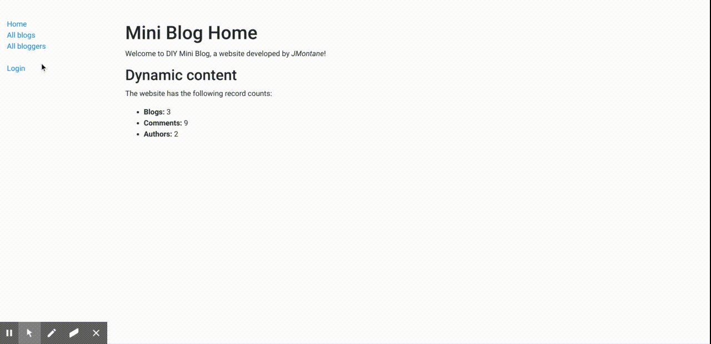

# DIY Mini Blog
> A django-based mini blog.             

## Live
You can take a look clicking [here](https://mdn-django-diyblog.herokuapp.com/).

## Overview

Basic blog site written in Django (part of MDN Django module assessment)
----
This web application creates an very basic blog site using Django. The site allows blog authors to create text-only blogs using the Admin site, and any logged in user to add comments via a form. Any user can list all bloggers, all blogs, and detail for bloggers and blogs (including comments for each blog).

The models for this site are as shown below:

## Technologies

For this project, I used **Django**, following Mdn requirements for the assessment, but no guidance at all.       
It has been deployed on [Heroku](https://www.heroku.com/).

## Motivation

Before doing more ambitious projects and learn new things, I wanted to go back to the fundamentals, and study them as much as I could.                  
_I was following Mozilla Developer Network Tutorial [MDN Django Web Framework](https://developer.mozilla.org/en-US/docs/Learn/Server-side/Django)._        
_For more information see the associated [MDN assessment page](https://github.com/mdn/django-diy-blog)._

## Meta

JMontane – [jmontane.dev](https://www.jmontane.dev)

Github profile [jaumemy](https://github.com/jaumemy/)

Source code repo [Mdn](https://github.com/mdn/django-diy-blog)
